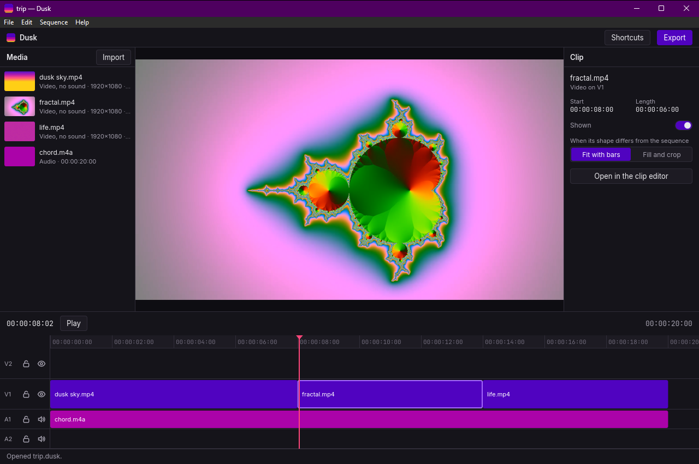
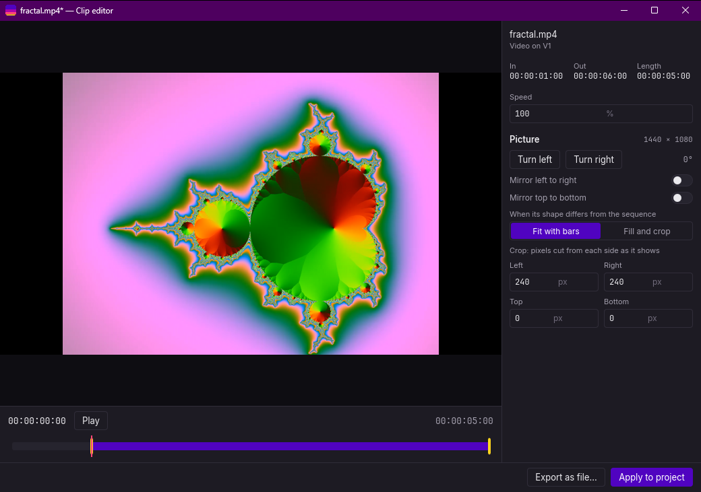

<p align="center"></p>

# Dusk

Dusk is a free, open-source video editor for Windows, built in Rust. It is light to install, light to open and light on memory, with no accounts, no cloud, no ads and no telemetry. Its signature is in-place clip editing: double-click any clip on the timeline and a window opens to trim, crop, turn, slow down or quiet just that clip, then apply it back to the project or save it as its own file.



## Install

1. Download `dusk-0.1.0-setup.exe` from the [releases page](https://github.com/GitGud16/dusk/releases).
2. Run it. The installer is not signed, so Windows may say "Windows protected your PC": choose **More info**, then **Run anyway**.
3. It installs for you alone, without administrator rights, puts Dusk in the Start menu and can open `.dusk` projects. Uninstalling it from Windows' settings leaves your projects and settings alone.

Dusk needs Windows 10 or 11 (64-bit) and a graphics driver with Vulkan or Direct3D 12, which every graphics card of the last ten years has.

## A first edit

1. **Bring in a video**: drop it on the window, or press **Import**.
2. **Put it on the timeline**: drag it there, or select it and press `P`.
3. **Cut it**: move the playhead with a click on the ruler or the arrow keys, and press `S` to split the clip there. Click the part you do not want (or press `D` for the clip under the playhead) and press `Delete`.
4. **Edit one clip on its own**: double-click it, or press `Enter`, to trim, crop, turn, mirror, change its speed, volume or fades in the clip editor, then press **Apply to project**.
5. **Export**: press **Export**, pick a file format and a quality, then **Export…** and where to save.

Every action has keys: `?` or `F1` lists them, and [docs/SHORTCUTS.md](docs/SHORTCUTS.md) has them all. Dusk saves an autosave every 30 seconds and offers it back after a crash.



## Make a video smaller, or take its sound out

**File → Compress a video…** (`Ctrl+M`) makes a smaller copy of a video for a chat app or an email: aim at a size such as 25 MB, or at a quality. The same jobs run without opening Dusk with `dusq`, the command line beside it in Dusk's folder:

```powershell
dusq compress holiday.mp4 --size 25MB
dusq extract-audio voice-note.mp4 --format mp3
dusq --help
```

## Building

Windows 10/11 with Rust, the Visual Studio C++ build tools, LLVM and the pinned FFmpeg build; [docs/SETUP.md](docs/SETUP.md) has the details. In short:

```powershell
powershell -ExecutionPolicy Bypass -File scripts\setup-ffmpeg.ps1   # once
. .\scripts\dev-env.ps1                                             # in every new shell
cargo run -p dusk-app
```

`scripts\build-release.ps1` builds the installer ([docs/SETUP.md](docs/SETUP.md), "Release"). To help, see [CONTRIBUTING.md](CONTRIBUTING.md).

## Design

[docs/VISION.md](docs/VISION.md) says why Dusk exists and what it is not; [docs/FEATURES.md](docs/FEATURES.md) what it does, [docs/REQUIREMENTS.md](docs/REQUIREMENTS.md) how light it must stay, [docs/ARCHITECTURE.md](docs/ARCHITECTURE.md) how it is built, [docs/THEME.md](docs/THEME.md) how it looks, and [docs/ROADMAP.md](docs/ROADMAP.md) where it is going.

## License

Dusk's own code is under the MIT License ([LICENSE](LICENSE)). It uses FFmpeg's libraries under the GNU LGPL, linked dynamically; Slint under the Slint Royalty-free License 2.0; and the Inter and JetBrains Mono fonts under the SIL Open Font License. The installer puts every license in the `licenses` folder beside Dusk.

<a href="https://slint.dev"><picture><source media="(prefers-color-scheme: dark)" srcset="docs/images/made-with-slint-dark.svg"></picture></a>
